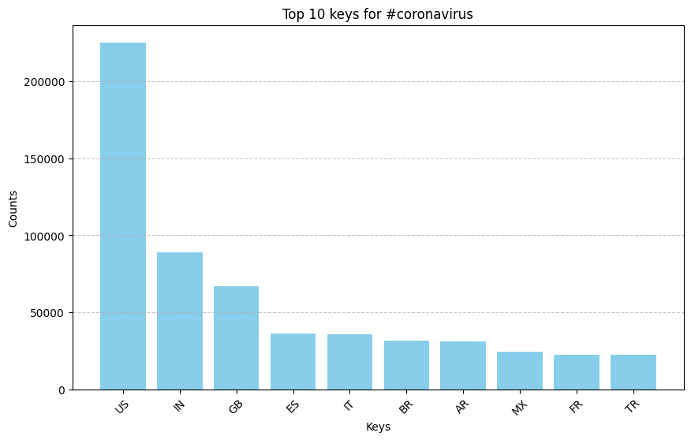

# Twitter Hashtag Analysis Using MapReduce

## **Overview**
This project processes and visualizes Twitter data using a MapReduce approach. The pipeline:
1. **Maps** raw tweet data to structured JSON outputs (`map.py`).
2. **Reduces** the structured data into summarized counts (`reduce.py`).
3. **Visualizes** hashtag trends (`visualize.py`).
4. **Generates alternative aggregated insights** (`alternative_reduce.py`).

This implementation efficiently processes large-scale Twitter data using JSON files and generates meaningful insights on hashtag usage trends.

---

## **Results**
### 🔹 **Top Languages for `#coronavirus`**


### 🔹 **Top Languages for `#코로나바이러스`**


### 🔹 **Top Countries for `#coronavirus`**


### 🔹 **Top Countries for `#코로나바이러스`**


### 🔹 **Hashtag Trends Over Time**
This line chart shows the tweet frequency for selected hashtags over time.


---

## **How to Run the Pipeline**
### **1️⃣ Run the Mapper**
```bash
nohup ./run_maps.sh > run_maps_master.log 2>&1 &
```

### **2️⃣ Run the Reducer**
```bash
python3 src/reduce.py --input_paths output/*.lang --output_path output/all_lang.json
python3 src/reduce.py --input_paths output/*.country --output_path output/all_country.json
```

### **3️⃣ Generate Visualizations**
```bash
python3 src/visualize.py --input_path output/all_lang.json --key "#coronavirus"
python3 src/visualize.py --input_path output/all_lang.json --key "#코로나바이러스"
python3 src/visualize.py --input_path output/all_country.json --key "#coronavirus"
python3 src/visualize.py --input_path output/all_country.json --key "#코로나바이러스"
```

### **4️⃣ Generate Alternative Reduce Analysis**
```bash
python3 src/alternative_reduce.py --hashtags "#coronavirus" "#flu" --output_path output/hashtag_trend.png
```

---

## **Key Features**
- **MapReduce-inspired architecture** for processing Twitter data.
- **Supports multiple languages and geolocations.**
- **Generates PNG visualizations of hashtag trends.**
- **Optimized for parallel execution using `nohup` and batch processing.**

---

## **Next Steps**
Future improvements could include:
- **Improved time tracking for hashtag trends.**
- **Streaming data processing with Apache Spark.**
- **More advanced visualizations with interactive dashboards.**

