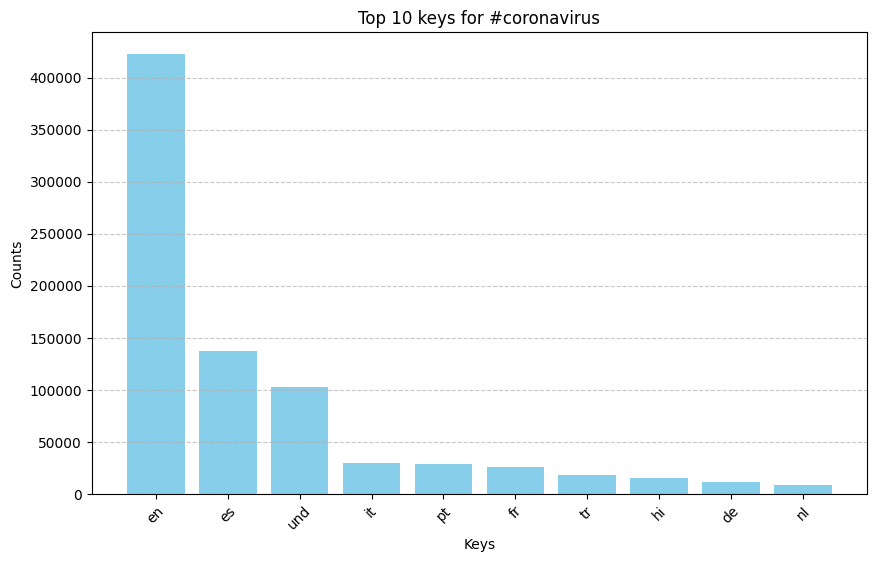

# Twitter Hashtag Analysis Using MapReduce

## **Overview**
This project processes and visualizes Twitter data using a MapReduce approach. The pipeline:
1. **Maps** raw tweet data to structured JSON outputs (`map.py`).
2. **Reduces** the structured data into summarized counts (`reduce.py`).
3. **Visualizes** hashtag trends (`visualize.py`).
4. **Generates alternative aggregated insights** (`alternative_reduce.py`).

This implementation efficiently processes large-scale Twitter data using JSON files and generates meaningful insights on hashtag usage trends.

---

## **Results**
### 🔹 **Top Languages for `#coronavirus`**


### 🔹 **Top Languages for `#코로나바이러스`**


### 🔹 **Top Countries for `#coronavirus`**


### 🔹 **Top Countries for `#코로나바이러스`**


---

## **How to Run the Pipeline**
### **1️⃣ Run the Mapper**
```bash
nohup ./run_maps.sh > run_maps_master.log 2>&1 &

